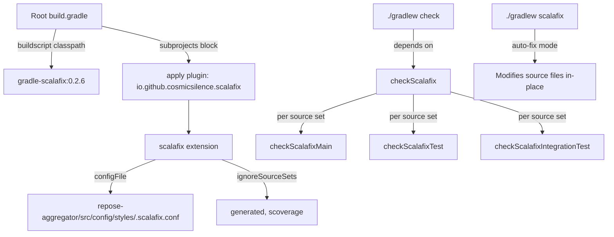

# Design Document: Scalafix Migration

## Overview

This design describes the migration from the deprecated Scalastyle Gradle plugin to the Scalafix Gradle plugin (`io.github.cosmicsilence:gradle-scalafix:0.2.6`) for the Repose project. The migration restores Scala static analysis capability that was lost during the Java 11 upgrade, integrates with the existing `check` lifecycle, and provides auto-fix support.

The approach uses the `buildscript`/`apply` pattern consistent with all other plugins in this project (not the `plugins {}` DSL). The Scalafix plugin is applied uniformly to all subprojects, with generated source sets excluded. A shared `.scalafix.conf` configuration file defines the active rules.

### Key Design Decisions

1. **Syntactic rules only (no SemanticDB)**: The initial configuration uses only syntactic rules (DisableSyntax, ProcedureSyntax, etc.) plus OrganizeImports. This avoids requiring the SemanticDB compiler plugin, which would add compilation overhead. SemanticDB can be enabled later if semantic rules (e.g., RemoveUnused) are desired.

2. **Conservative DisableSyntax settings**: We enable `noVars`, `noNulls`, and `noThrows` as specified in requirements. These are lint-only (no auto-fix) and may produce violations in existing code. The team should run `./gradlew checkScalafix` to assess the violation count before enforcing in CI.

3. **Scalafmt deferred**: The old Scalastyle config was primarily whitespace/formatting regex checks. Scalafix's DisableSyntax can partially cover these via regex patterns, but detailed whitespace enforcement is better handled by Scalafmt. This design documents the gap and recommends Scalafmt as a future enhancement.

4. **Scoverage source set ignored**: The Scoverage plugin creates a `scoverage` source set that mirrors `main`. Processing it with Scalafix would duplicate work, so it is excluded via `ignoreSourceSets`.

## Architecture

The integration follows the same pattern as Checkstyle and CodeNarc in this project:



### Task Lifecycle Integration

The `checkScalafix` task is automatically wired as a dependency of `check` by the gradle-scalafix plugin itself (per the plugin documentation: "This task is automatically triggered by the check task"). No explicit `check.dependsOn checkScalafix` is needed.

The task execution order within `check` becomes:
1. `checkstyleMain` / `checkstyleTest` (Java)
2. `codenarcMain` / `codenarcTest` (Groovy)
3. `checkScalafixMain` / `checkScalafixTest` / `checkScalafixIntegrationTest` (Scala)
4. `test` / `integrationTest`
5. Coverage verification tasks

## Components and Interfaces

### Component 1: Buildscript Dependency Declaration

**Location**: `build.gradle` (root), `buildscript.dependencies` block

**Change**: Add the Scalafix plugin classpath entry alongside existing plugin dependencies.

```groovy
buildscript {
    dependencies {
        // ... existing dependencies ...
        classpath 'io.github.cosmicsilence:gradle-scalafix:0.2.6'
    }
}
```

The Gradle Plugin Portal repository (`https://plugins.gradle.org/m2/`) is already declared in the `buildscript.repositories` block, so no repository changes are needed.

### Component 2: Plugin Application and Configuration

**Location**: `build.gradle` (root), `subprojects` block

**Change**: Apply the plugin and configure the extension.

```groovy
subprojects {
    // ... existing plugin applications ...
    apply plugin: 'io.github.cosmicsilence.scalafix'

    // Scalafix: Scala linting and auto-fix (replaces deprecated Scalastyle)
    // Usage:
    //   ./gradlew checkScalafix   - lint only, fails on violations (runs as part of 'check')
    //   ./gradlew scalafix        - auto-fix mode, modifies files in-place
    scalafix {
        configFile = file("$rootDir/repose-aggregator/src/config/styles/.scalafix.conf")
        ignoreSourceSets = ['generated', 'scoverage']
        semanticdb {
            autoConfigure = true
        }
    }
}
```

**Rationale for `ignoreSourceSets`**:
- `generated`: JAXB-generated Java code should not be linted by Scala rules
- `scoverage`: Mirrors `main` sources; processing it would duplicate analysis

**Rationale for `semanticdb.autoConfigure = true`** (default):
- OrganizeImports requires SemanticDB for its `removeUnused` feature
- The plugin handles SemanticDB setup automatically — it adds the compiler plugin and required flags to ScalaCompile tasks
- This does mean Scala compilation runs before checkScalafix, but that's acceptable since `check` already depends on compilation

### Component 3: Scalafix Configuration File

**Location**: `repose-aggregator/src/config/styles/.scalafix.conf`

**Format**: HOCON (Human-Optimized Config Object Notation)

The configuration file defines which rules are active and their settings. See the Data Models section for the full file content.

### Component 4: Legacy Cleanup

**Location**: `build.gradle` (root)

**Changes**: Remove all commented-out Scalastyle references:
- Remove `// classpath 'org.github.ngbinh.scalastyle:gradle-scalastyle-plugin_2.11:1.0.1'` from buildscript dependencies
- Remove `// apply plugin: 'scalaStyle'` from subprojects block
- Remove the commented-out `// scalaStyle { ... }` configuration block
- Remove `// check.dependsOn scalaStyle` from subprojects block
- Remove associated `//todo:` comment about the plugin quality

## Data Models

### .scalafix.conf File Content

```hocon
# Scalafix Configuration for Repose Project
# Location: repose-aggregator/src/config/styles/.scalafix.conf
#
# This configuration replaces the deprecated scalastyle_config.xml.
# See PLUGIN-ALTERNATIVES.md for migration context.
#
# Scalastyle Coverage Mapping:
# ============================================================================
# COVERED by Scalafix rules:
#   - DisableSyntax.noVars: Catches mutable variable usage
#   - DisableSyntax.noNulls: Catches null usage
#   - DisableSyntax.noThrows: Catches throw usage
#   - ProcedureSyntax: Catches deprecated def foo() { } style
#   - OrganizeImports: Enforces import ordering and blank lines after imports
#
# NOT COVERED (whitespace/formatting concerns — recommend Scalafmt):
#   - Spacing before parens after if/for/while (e.g., `if(` vs `if (`)
#   - Spacing before left braces (e.g., `){` vs `) {`)
#   - Single space enforcement (no multiple spaces)
#   - Brace placement (same-line vs new-line)
#   - Spacing after comma/semicolon/colon
#   - Blank line after package declaration
#   - Max consecutive blank lines limit
#   - Blank line after import block
#
# These whitespace rules were regex-based checks in Scalastyle. Scalafix is
# not a formatting tool — use Scalafmt for whitespace and formatting concerns.
# Adding Scalafmt is recommended as a future enhancement.
# ============================================================================

rules = [
  DisableSyntax
  OrganizeImports
  LeakingImplicitClassVal
  NoValInForComprehension
  ProcedureSyntax
]

# DisableSyntax: Report errors for unsafe Scala constructs
DisableSyntax {
  noVars = true
  noNulls = true
  noThrows = true
}

# OrganizeImports: Enforce consistent import ordering
# Groups: java/javax first, then scala, then everything else
OrganizeImports {
  blankLines = Auto
  groups = [
    "re:javax?\\."
    "scala."
    "*"
  ]
  groupedImports = Keep
  importSelectorsOrder = Ascii
  removeUnused = true
}
```

### Build.gradle Modifications Summary

| Section | Action | Detail |
|---------|--------|--------|
| `buildscript.dependencies` | ADD | `classpath 'io.github.cosmicsilence:gradle-scalafix:0.2.6'` |
| `buildscript.dependencies` | REMOVE | Commented-out scalastyle classpath line |
| `subprojects` | ADD | `apply plugin: 'io.github.cosmicsilence.scalafix'` |
| `subprojects` | ADD | `scalafix { ... }` extension block |
| `subprojects` | REMOVE | Commented-out `apply plugin: 'scalaStyle'` |
| `subprojects` | REMOVE | Commented-out `scalaStyle { ... }` block |
| `subprojects` | REMOVE | Commented-out `check.dependsOn scalaStyle` |
| `subprojects` | REMOVE | `//todo: write a good one of these plugins` comment |

## Error Handling

### Build Failure on Violations

When `checkScalafix` detects a rule violation, the Scalafix engine produces error messages in the format:

```
file.scala:LINE: error: [RuleName.category] description
  offending code
  ^^^^^
```

The Gradle task fails with a non-zero exit code, which fails the `check` lifecycle task. This is the same behavior as Checkstyle and CodeNarc.

### Configuration Parse Errors

If `.scalafix.conf` contains invalid HOCON syntax, the Scalafix plugin will fail with a configuration parse error at task execution time. The error message from the HOCON parser identifies the line and character position of the syntax error.

### Missing Configuration File

If the `configFile` path does not resolve to an existing file, the plugin will fall back to searching for `.scalafix.conf` in the project root directory, then run with no rules (effectively a no-op). The explicit `configFile` setting prevents this ambiguity.

### SemanticDB Compilation Failures

If SemanticDB compilation fails (e.g., due to Scala version incompatibility), the `checkScalafix` task will fail during the compilation phase before rule execution. The gradle-scalafix plugin automatically selects a SemanticDB version compatible with Scala 2.12.x.

### Graceful Degradation for Non-Scala Subprojects

Subprojects that have no Scala source files will have `checkScalafix` tasks created but they will be no-ops (no files to analyze). The plugin handles this gracefully — no errors are produced for empty source sets.

## Testing Strategy

### Why Property-Based Testing Does Not Apply

This feature is entirely build configuration and infrastructure tooling. There are no pure functions with varying inputs, no data transformations, and no business logic. All acceptance criteria fall into SMOKE (configuration checks) or INTEGRATION (build execution verification) categories. Property-based testing is not applicable.

### Integration Testing Approach

The primary verification strategy is running the actual Gradle build with the new configuration:

1. **Dependency Resolution Test**
   - Run `./gradlew buildEnvironment` to verify the Scalafix plugin resolves without classpath conflicts
   - Expected: Plugin appears in the buildscript classpath without errors

2. **Plugin Application Test**
   - Run `./gradlew tasks --all | grep -i scalafix` to verify Scalafix tasks are registered
   - Expected: `checkScalafix`, `checkScalafixMain`, `checkScalafixTest`, `checkScalafixIntegrationTest`, `scalafix`, `scalafixMain`, etc. appear

3. **Configuration Validation Test**
   - Run `./gradlew checkScalafixMain` on a subproject with Scala sources
   - Expected: Task executes using the shared config file (may report violations or pass)

4. **Check Lifecycle Integration Test**
   - Run `./gradlew check --dry-run` on a Scala subproject
   - Expected: `checkScalafix` tasks appear in the execution plan

5. **Auto-Fix Mode Test**
   - Create a test file with procedure syntax (`def foo() { }`)
   - Run `./gradlew scalafix`
   - Expected: File is rewritten to `def foo(): Unit = { }`

6. **Source Set Exclusion Test**
   - Verify that `checkScalafixGenerated` task does NOT exist (since `generated` is in `ignoreSourceSets`)
   - Expected: Only `checkScalafixMain`, `checkScalafixTest`, `checkScalafixIntegrationTest` tasks exist

7. **Full Build Regression Test**
   - Run `./gradlew build` (or `./gradlew compileScala compileTestScala`)
   - Expected: All subprojects compile and test without regressions introduced by the plugin

### Smoke Tests (Manual Verification)

- `.scalafix.conf` file exists at the expected path
- File is valid HOCON (parseable without errors)
- All 5 rules are listed in the `rules` array
- DisableSyntax options (`noVars`, `noNulls`, `noThrows`) are set to `true`
- Comments document Scalastyle coverage mapping
- Comments recommend Scalafmt for whitespace concerns
- No commented-out Scalastyle references remain in `build.gradle`

### Initial Rollout Consideration

The `DisableSyntax` rule with `noVars = true`, `noNulls = true`, `noThrows = true` will likely produce violations in existing code. The recommended rollout approach:

1. First, run `./gradlew checkScalafix` to assess the violation count
2. If violations are excessive, consider:
   - Temporarily setting the problematic options to `false`
   - Using `// scalafix:off` / `// scalafix:on` suppression comments for known exceptions
   - Fixing violations incrementally using `./gradlew scalafix` for auto-fixable rules
3. Once violations are manageable, enforce in CI via the `check` task
